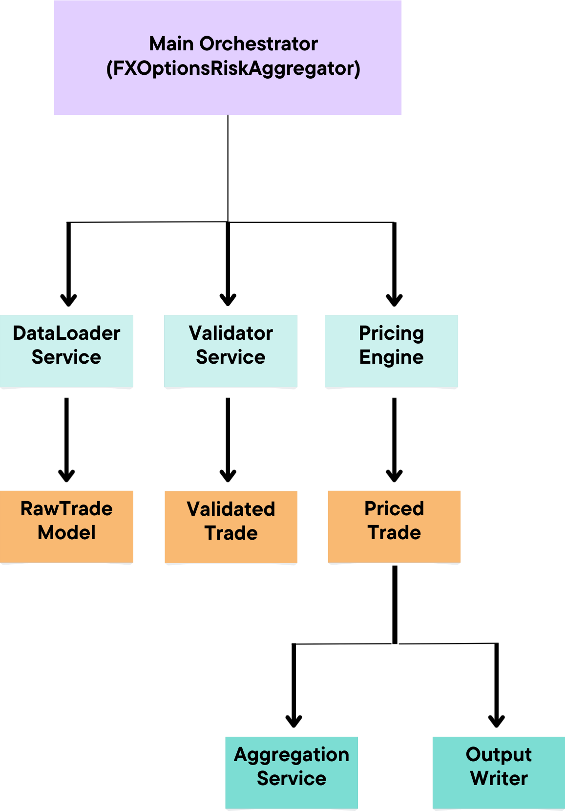

Below is a **fully rewritten, clean, GitHub-safe version of your README**, with:

* ✅ **All math rendering fixed** (using fenced `math` blocks)
* ✅ Clear structure and consistent tone
* ✅ Professional, interview-ready wording
* ✅ No Markdown edge cases that break GitHub rendering
* ✅ Your original content preserved, clarified, and polished

You can **copy–paste this directly** into `README.md`.

---

# FX Options Portfolio Risk Aggregator

A Python application for pricing and aggregating **FX options portfolios** using the **Garman–Kohlhagen (Black–Scholes for FX)** model.
The system integrates quantitative finance, robust data validation, and multi-currency aggregation with production-quality software design.

---

## Overview

The FX Options Portfolio Risk Aggregator:

* Reads FX options portfolios from Excel files
* Validates trade data using **Pydantic models** with business-logic checks
* Prices each option using the **Black–Scholes FX model**
* Computes key risk metrics:

  * Present Value (PV)
  * Delta
  * Vega
* Converts all metrics into a **unified reporting currency**
* Aggregates results at the portfolio level
* Exports detailed trade-level and portfolio-level results to Excel

---

## Architecture

The application follows a **Service-Oriented Architecture**, ensuring a clear separation of concerns.



### Key Components

#### 1. Domain Models (`models.py`)

* **RawTrade**: Accepts loosely typed input data
* **ValidatedTrade**: Strongly typed, validated trade ready for pricing
* **PricedTrade**: Trade with computed risk metrics in notional currency
* **PortfolioSummary**: Aggregated portfolio-level metrics in reporting currency

#### 2. Services

* **DataLoaderService** – Reads Excel files and parses raw trade data
* **ValidationService** – Applies structural and business-logic validation
* **PricingEngineService** – Implements FX Black–Scholes pricing
* **AggregationService** – Performs currency conversion and aggregation
* **OutputWriterService** – Writes formatted Excel outputs

#### 3. Configuration (`config.py`)

* Centralised valuation parameters
* Market conventions and assumptions
* Reporting currency (default: USD)

---

## Quantitative Model

### Black–Scholes for FX Options

The pricing engine implements the **Garman–Kohlhagen** model.

#### Call Option Present Value

```math
C = S \cdot e^{-r_f T} \cdot N(d_1) - K \cdot e^{-r_d T} \cdot N(d_2)
```

#### Put Option Present Value

```math
P = K \cdot e^{-r_d T} \cdot N(-d_2) - S \cdot e^{-r_f T} \cdot N(-d_1)
```

#### Where

* `S` – Spot FX rate
* `K` – Strike price
* `T` – Time to expiry (in years)
* `r_d` – Domestic risk-free rate
* `r_f` – Foreign risk-free rate
* `σ` – Implied volatility
* `N(·)` – Cumulative standard normal distribution

The auxiliary terms are defined as:

* $d_1 = \frac{\ln(S/K) + (r_d - r_f + \sigma^2 / 2), T}{\sigma \sqrt{T}}$
* $d_2 = d_1 - \sigma \sqrt{T}$

---

## Greeks Computation

### Delta (Δ)

Sensitivity of option value to changes in the spot FX rate.

```math
\text{Call Delta} = e^{-r_f T} \cdot N(d_1) \cdot \text{Notional}
```

```math
\text{Put Delta} = e^{-r_f T} \cdot \bigl[N(d_1) - 1\bigr] \cdot \text{Notional}
```

---

### Vega (ν)

Sensitivity of option value to a **1% change in volatility**.

```math
\text{Vega}
= \frac{S \cdot e^{-r_f T} \cdot n(d_1) \cdot \sqrt{T} \cdot \text{Notional}}{100}
```

where `n(·)` is the **standard normal probability density function**.

---

## Multi-Currency Handling

The system supports portfolios containing trades with different **notional currencies** (e.g. USD, JPY).

### Currency Conversion Logic

* Trades are priced in their **notional currency**
* Before aggregation, all PVs, Deltas, and Vegas are converted into the **reporting currency**

**Conversion factors:**

* USD → USD: factor = 1
* JPY → USD: factor = 1 / spot
* USD → JPY: factor = spot

All portfolio totals are reported in the configured reporting currency.

---

## Installation

### Requirements

* Python 3.9+
* Dependencies:

  * `pandas`
  * `openpyxl`
  * `pydantic`
  * `numpy`
  * `scipy`
  * `python-dateutil`

### Setup

```bash
python -m venv venv

# Activate virtual environment
# Windows:
venv\Scripts\activate
# macOS / Linux:
source venv/bin/activate

pip install -r requirements.txt
```

---

## Usage

### Run the Aggregator

```bash
python main.py fx_trades__1_.xlsx
```

Specify a custom output file:

```bash
python main.py fx_trades__1_.xlsx -o trade_results.xlsx
```

---

## Output

The generated Excel file contains two sheets:

### Trade_Results

* TradeID
* CurrencyPair
* OptionType
* Strike
* Notional
* NotionalCurrency
* Spot
* TimeToExpiry
* Volatility
* PV
* Delta
* Vega

### Portfolio_Summary

* Total Trades
* Total PV (reporting currency)
* Total Delta (reporting currency)
* Total Vega (reporting currency)
* Valuation Date

---

## Input File Format

The input Excel file must contain:

* TradeID
* Underlying
* Notional
* NotionalCurrency
* Spot
* Strike
* Vol
* RateDomestic
* RateForeign
* Expiry
* OptionType

---

## Testing

Unit tests cover:

* Black–Scholes pricing accuracy (ATM, ITM, OTM)
* Put–call parity
* Delta and Vega correctness
* Trade validation rules
* Portfolio aggregation logic
* Error handling and edge cases

Tests are designed to validate both **quantitative correctness** and **system robustness**.

---

## Design Principles

### Separation of Concerns

Each service has a single, well-defined responsibility.

### Type Safety

* Full type hints throughout
* Pydantic enforces correctness at data boundaries

### Fail-Fast Validation

* Structural and business-logic validation
* Clear error messages

### Multi-Currency Awareness

* No mixing of currencies in aggregated results
* Explicit reporting currency

### Testability

* Pure pricing functions
* Dependency injection for services
* High unit-test coverage

---

## Assumptions

### Market Assumptions

* European options
* Continuously compounded rates
* Constant volatility and interest rates
* No transaction costs or arbitrage

### Currency Conversion

* Spot rates used for conversion
* Mid-market rates
* No bid/ask spreads

### Data

* Market data is observable and reliable
* No counterparty or credit risk

---

## Summary

This project demonstrates:

* Correct quantitative finance implementation
* Production-quality Python engineering
* Strong validation and testing discipline
* Robust handling of multi-currency portfolios


